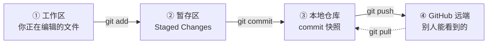

# Git 操作笔记（新手版）

> 适用对象：本项目「我的博客」的日常维护
> **一句话记住：改文件 → 提交 → 上传，三步走。**

---

## 一、先建立一个画面：Git 有四个地方

这是理解一切的钥匙。你的文件会依次经过这四个地方：



| 地方 | 大白话 | 在哪看 |
|---|---|---|
| ① 工作区 | 你刚改完、还没登记的文件 | VS Code 左侧「更改 Changes」 |
| ② 暂存区 | 已登记、准备打包进这次提交的文件 | VS Code 左侧「暂存的更改 Staged Changes」 |
| ③ 本地仓库 | 已经打好包的版本快照，只存在你电脑上 | `git log` |
| ④ GitHub 远端 | 上传成功的版本，网页上能看到的 | github.com 仓库页 |

**关键认知：`commit` 和 `push` 是两件事。**
只 `commit` → 只有你电脑上有，GitHub 上看不到。
只 `push` → 什么也不会发生，因为没有新东西可上传。

---

## 二、每一步是谁做、在哪做

| 步骤 | 命令 | 你能在哪操作 | 我在 WorkBuddy 里能否代做 |
|---|---|---|---|
| 改文件 | —— | VS Code / WorkBuddy | ✅ 能 |
| `git add`（放进暂存区） | `git add -A` | VS Code 点文件旁的 `+` | ✅ 能，自动做 |
| `git commit`（提交到本地仓库） | `git commit -m "说明"` | VS Code 写信息后按 `Ctrl+Enter` | ✅ 能，自动做 |
| `git push`（上传到 GitHub） | `git push` 或 `git pull && git push` | VS Code 点「推送」或「同步更改」 | ❌ **不能，必须你来** |

**关于最后一行**：我这边推送会卡住（弹不出登录窗口），所以凡是需要上传的操作都得你点一下。**其余三步我都能替你做完。**

### VS Code 按钮 ↔ 终端命令 对照表

**同一件事的两种做法，效果完全一样。** VS Code 的按钮只是把命令包装了一下，两边可以随意混用。

| 你想做的事 | VS Code 操作 | 终端命令 |
|---|---|---|
| 查看当前状态 | 看左侧「更改 / 暂存的更改」 | `git status` |
| 暂存某个文件 | 点文件右边的 `+` | `git add 文件名` |
| 暂存全部改动 | 鼠标移到「更改」标题上 → 点 `+` | `git add -A` |
| 取消暂存 | 在「暂存的更改」里点 `-`，或右键 →「取消暂存」 | `git restore --staged 文件名` |
| 提交到本地仓库 | 写信息 → `Ctrl+Enter` | `git commit -m "信息"` |
| 只拉取，不推送 | 点「拉取 Pull」 | `git pull` |
| **只推送** | 点「推送 Push」 | `git push` |
| **拉取 + 推送** | 点「**同步更改 Sync Changes**」 | `git pull && git push` |
| 查看提交历史 | `Ctrl+Shift+P` → `Git: View History` | `git log --oneline` |
| 看改动具体内容 | 点文件 → 打开 diff 视图 | `git diff` |

> ⚠️ **一个最容易搞错的点：「推送」和「同步更改」不是同一件事。**
> - 「推送 Push」= 只执行 `git push`
> - 「同步更改 Sync Changes」= **先 `git pull`，再 `git push`**（先拉后推）
>
> 单人博客项目里两者结果通常一样，因为远端一般没有你本地缺失的内容。
> 但如果你在 GitHub 网页上直接改过文件（比如在线编辑了 README），
> 这时「只推送」会被拒绝，必须用「同步更改」先把远端的改动拉下来。
> **稳妥起见，无脑点「同步更改」就行。**

---

## 三、日常流程 A：让我帮你改内容（你现在主要在用的）

1. 在 WorkBuddy 里告诉我要改什么 → 我改文件，**并自动完成 `add` + `commit`**
2. 切到 VS Code，看左下角状态栏有没有 **`↑1`** 这样的徽标
3. 有 → 点旁边的「**同步更改 Sync Changes**」，等几秒
4. 徽标消失 = 上传完成

**不想开 VS Code 的话，第 2～4 步在终端里等价于：**

```bash
cd /d E:\DevWorkspace\DevProjects\web
git pull && git push
```

（`git status` 可以先看一眼确认状态；只要终端没报错，就是推成功了。）

> ⚠️ 我改的东西**不会**出现在 VS Code 左侧的「更改」列表里 —— 因为它已经被我直接提交进本地仓库了，跳过了那一栏。
> 看到左侧是空的**不代表没生效**，只代表"已经提交好了"。

---

## 四、日常流程 B：你自己在 VS Code 里改内容

1. 改完文件，按 `Ctrl+Shift+G` 打开源代码管理面板
2. 「更改 Changes」里会列出你动过的文件 → 点文件右边的 **`+`** 把它移进「暂存的更改」
3. 顶部输入框写一句说明，例如 `更新关于页面的个人简介`
4. 按 **`Ctrl+Enter`**（或点上面的 `✓`）→ 提交完成
5. 状态栏出现 `↑1` → 点「**同步更改**」上传

**如果不想提交某个文件**：在「暂存的更改」里右键它 → 「取消暂存」。

**同样的三步，在终端里就是：**

```bash
cd /d E:\DevWorkspace\DevProjects\web
git status                              # 先看有哪些改动
git add -A                              # ① 暂存   ← 等价于点 `+`
git commit -m "更新关于页面的个人简介"    # ② 提交   ← 等价于写信息 + Ctrl+Enter
git pull && git push                    # ③ 上传   ← 等价于点「同步更改」
```

---

## 五、日常流程 C：纯终端操作

在项目目录下依次执行：

```bash
cd /d E:\DevWorkspace\DevProjects\web

git status                 # 看清当前状态（最该养成习惯的一条）  ← VS Code：看左侧列表
git add -A                 # 把所有改动放进暂存区                ← VS Code：点 `+`
git commit -m "说明文字"    # 提交到本地仓库                     ← VS Code：写信息 + Ctrl+Enter
git push                   # 上传到 GitHub                      ← VS Code：点「推送」
```

熟了就合成一条：

```bash
git add -A && git commit -m "说明文字" && git pull && git push
```

**最后一步有讲究**，它对应 VS Code 的两个不同按钮：

| 写法 | 含义 | 对应 VS Code 按钮 |
|---|---|---|
| `git push` | 只上传 | 「推送 Push」 |
| `git pull && git push` | 先拉远端、再上传 | 「**同步更改 Sync Changes**」 |

**日常建议用后者**（`git pull && git push`）。它和「同步更改」完全等价，能顺带处理"远端有你本地没有的内容"这种情况，不会因为落后于远端而被拒绝。

> `cd /d` 是 **cmd** 的写法（`/d` 用于跨盘符切换）。在 PowerShell 或 Git Bash 里直接 `cd E:\DevWorkspace\DevProjects\web` 即可。

---

## 六、判断"到底同步好了没有"——只看一个地方

**VS Code 左下角的状态栏徽标**，它是唯一可靠的信号：

| 看到什么 | 含义 | 该做什么 |
|---|---|---|
| 没有 `↑` `↓` | 本地和 GitHub 完全一致 | 什么都不用做 |
| `↑1`（或 `↑n`） | 有 n 个提交没上传 | 点「同步更改」 |
| `↓1` | GitHub 上有你本地没有的内容 | 点「同步更改」（它会先拉取再上传） |

左侧文件列表是空的不重要，**徽标才重要**。

---

## 七、常见问题

**Q：点了「推送 / 同步更改」，什么反应都没有？**
A：说明**没有可推送的提交**。通常是这两种情况之一：
① 改动还没 `commit`（还在「暂存的更改」里躺着）；
② 之前的提交已经推完了，本来就没东西可推。
先看状态栏徽标，没有 `↑` 就是"无事可做"，属于正常现象。

**Q：明明提交了，GitHub 网页上却没有？**
A：只做了 `commit` 没做 `push`。补一次「同步更改」即可。

**Q：`git add` 之后我又改了文件，改动会进去吗？**
A：**不会。** `add` 是"拍照"，拍完之后再改的东西不在这张照片里。
必须**再 `add` 一次**，否则新改动不跟着走。

**Q：`git push` 报连不上 GitHub（connect / timeout）？**
A：代理没生效。本机代理端口是 `7897`，配置命令：
```bash
git config --global http.https://github.com.proxy http://127.0.0.1:7897
```

**Q：提交历史怎么看？**
```bash
git log --oneline        # 一行一条，简洁
git log --oneline -5     # 只看最近 5 条
```

**Q：提交信息该怎么写？**
A：写"做了什么"，让人一眼看懂。例如：
- ✅ `更新关于页面的个人简介`
- ✅ `修复文章列表排序错误`
- ❌ `update`、`修改`、`111`

---

## 八、三条铁律

1. **`add` 之后又改过文件，必须再 `add` 一次**，否则新内容不进去。
2. **`commit` 之后不 `push`，GitHub 上永远看不到。**
3. **上传前先看状态栏有没有 `↑n`**，没有就说明没有待上传的内容。

---

## 附：已完成的一次性操作

### 把 `.workbuddy/` 移出版本控制

`.workbuddy/` 是 AI 助手的本地工作数据目录（项目笔记等），内容每天都在变，不适合放进仓库 —— 尤其不适合随仓库公开。已从版本控制中移除，**磁盘上的文件原样保留**。

用到的命令（**`--cached` 是关键，它只改 Git 的清单，不删磁盘文件**）：

```bash
git rm -r --cached .workbuddy     # 从 Git 清单里移除，磁盘文件不动
echo ".workbuddy/" >> .gitignore  # 以后自动忽略
git add -A
git commit -m "chore: 停止跟踪本地笔记"
git pull && git push              # 等价于 VS Code 点「同步更改」
```

如果误操作想恢复跟踪：`git add .workbuddy` 即可，文件一直都在。
